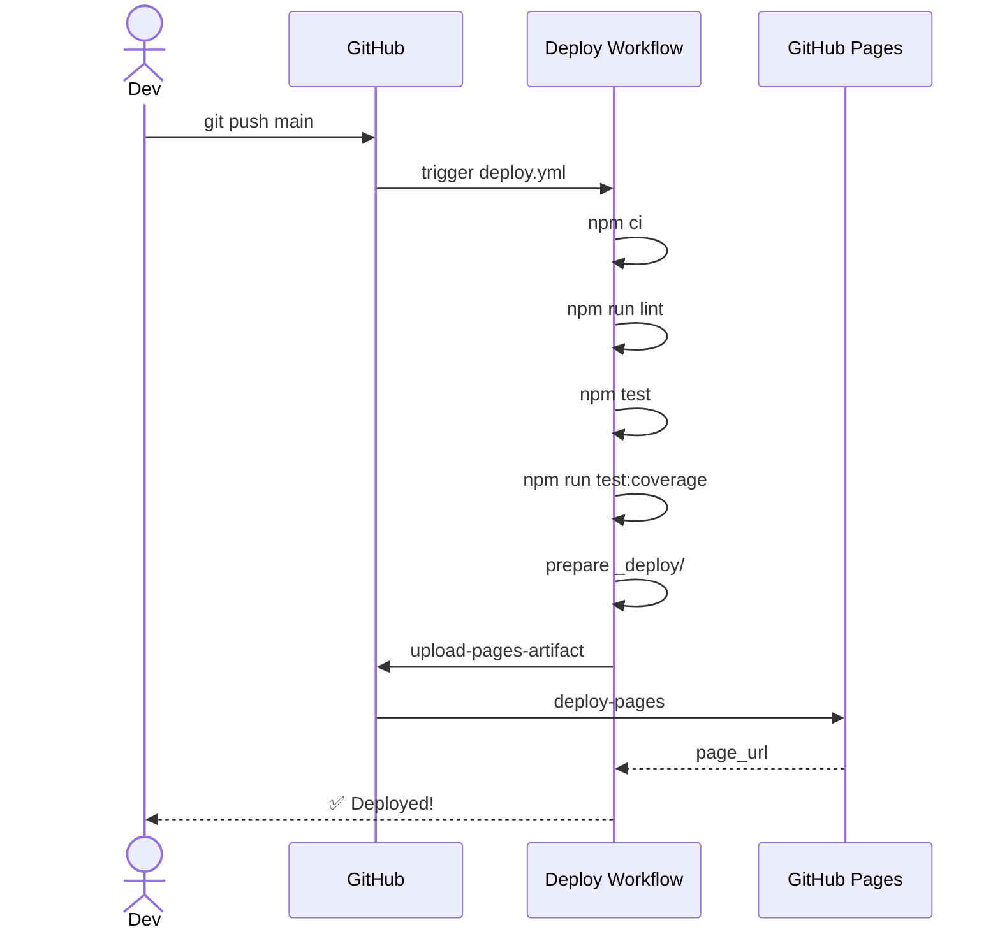
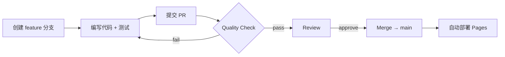

# CI/CD Pipeline 文档

> 本文档完整记录 AI-2048 项目的 CI/CD 流水线架构、工作流定义、质量门禁和部署流程。

---

## 目录

1. [流水线总览](#1-流水线总览)
2. [工作流详解](#2-工作流详解)
   - [2.1 Quality Check](#21-quality-check)
   - [2.2 Deploy to GitHub Pages](#22-deploy-to-github-pages)
3. [质量门禁](#3-质量门禁)
4. [AI 代码审查](#4-ai-代码审查)
5. [AI 测试生成](#5-ai-测试生成)
6. [部署架构](#6-部署架构)
7. [分支策略与 PR 流程](#7-分支策略与-pr-流程)
8. [环境变量与密钥](#8-环境变量与密钥)
9. [Artifact 管理](#9-artifact-管理)
10. [故障排查](#10-故障排查)

---

## 1. 流水线总览

```
                    ┌──────────────────┐
                    │   Push / PR      │
                    │  (main / master) │
                    └────────┬─────────┘
                             │
                    ┌────────▼─────────┐
                    │   Concurrency    │
                    │   Group & Cancel │
                    └────────┬─────────┘
                             │
              ┌──────────────┼──────────────┐
              │              │              │
       ┌──────▼──────┐ ┌────▼────┐ ┌──────▼──────┐
       │   Lint      │ │  Test   │ │  AI Review  │
       │  (语法检查)  │ │(Node矩阵)│ │ (审查+测试)  │
       └──────┬──────┘ └────┬────┘ └──────┬──────┘
              │              │              │
              └──────┬───────┘──────────────┘
                     │
              ┌──────▼──────┐
              │ Quality Gate│  ← 总成检查
              └──────┬──────┘
                     │
       ┌─────────────┼─────────────┐
       │  (仅 main)  │             │
       │             │             │
   ┌───▼───┐    ┌────▼────┐  ┌────▼────┐
   │Deploy │    │Coverage │  │Quality  │
   │Pages  │    │Artifact │  │Reports  │
   └───────┘    └─────────┘  └─────────┘
```

### 触发条件

| 事件 | 触发的工作流 |
|------|-------------|
| Push 到 `main` / `master` | `quality.yml` + `deploy.yml` |
| PR 提交到 `main` / `master` | `quality.yml` |
| 手动触发 (workflow_dispatch) | `deploy.yml` |

---

## 2. 工作流详解

### 2.1 Quality Check

**文件：** `.github/workflows/quality.yml`

职责：在每次 Push / PR 时执行完整的代码质量检查。

#### 作业矩阵

| 作业 | 运行环境 | 超时 | 说明 |
|------|----------|------|------|
| **lint** | ubuntu-latest | 5 min | 语法扫描（`npm run lint`） |
| **test** | ubuntu-latest | 10 min | Node.js 版本矩阵 **18 / 20 / 22**，并行执行 |
| **coverage** | ubuntu-latest | 10 min | LCOV 覆盖率报告，上传为 artifact |
| **ai-review** | ubuntu-latest | 10 min | AI 代码审查 + 边界测试生成 |
| **gate** | ubuntu-latest | 1 min | 汇总各作业结果，输出门禁结论 |

#### 并行策略

```
       ┌──── lint ────┐
       │              │
Push ──┼──── test ────┼── gate
       │  (18/20/22)  │
       │              │
       ├── coverage ──┤
       │              │
       └─ ai-review ──┘
```

- `lint`, `test`, `coverage`, `ai-review` 四个作业**完全并行**。
- `gate` 作业等待所有前置作业完成后执行**汇总判断**。
- `test` 内部的 Node 版本矩阵也并行运行，`fail-fast: false` 确保一个版本失败不影响其他版本。

#### 产物上传

| 名称 | 路径 | 保留周期 |
|------|------|----------|
| `coverage-report` | `coverage/` | 30 天 |
| `quality-reports` | `reports/` + `tests/ai_generated/` | 90 天 |

---

### 2.2 Deploy to GitHub Pages

**文件：** `.github/workflows/deploy.yml`

职责：在 Push 到 `main` / `master` 时自动构建并部署到 GitHub Pages。

#### 部署前检查

在部署前再次执行完整质量流水线：

1. `npm run lint` — 语法检查
2. `npm test` — 单元测试
3. `npm run test:coverage` — 覆盖率门禁
4. `npm run ai:tests` — AI 测试生成（忽略失败）
5. `npm run ai:review` — AI 审查（忽略失败）

> AI 步骤使用 `|| true` 允许无 API Key 时跳过，不阻塞部署。

#### 部署产物结构

```
_deploy/
├── index.html           # 游戏入口
├── style.css            # 样式
├── src/
│   ├── game.js          # 核心逻辑
│   ├── render.js        # 渲染模块
│   └── input.js         # 输入模块
├── docs/                # 项目文档
│   ├── TESTING.md
│   ├── AI_REVIEW.md
│   ├── COVERAGE_REPORT.md
│   ├── AI_TEST_CASES.md
│   ├── COMMUNITY_FEEDBACK.md
│   └── CI_CD_PIPELINE.md
└── _deploy_info.txt     # 部署时间戳
```

#### 所需权限

```yaml
permissions:
  contents: read
  pages: write
  id-token: write
```

#### 所需 Secrets

无（GitHub Pages 部署使用 OIDC + `deploy-pages` action，无需 Personal Access Token）。

---

## 3. 质量门禁

### 3.1 覆盖率阈值

| 指标 | 阈值 | 说明 |
|------|------|------|
| 行覆盖率 (Lines) | ≥ 70% | `--lines 70` |
| 函数覆盖率 (Functions) | ≥ 70% | `--functions 70` |
| 分支覆盖率 (Branches) | ≥ 60% | `--branches 60` |

配置位于 `package.json` 的 `nyc` 字段：

```json
"test:coverage": "nyc --reporter=text --reporter=html --reporter=lcov --check-coverage --lines 70 --functions 70 --branches 60 npm test"
```

### 3.2 Quality Gate 规则

`gate` 作业汇总所有前置作业，规则：

1. `lint` 必须通过（语法无错误）。
2. `test` matrix（18/20/22）全部通过（无测试失败）。
3. `coverage` 通过覆盖率阈值。
4. `ai-review` 完成（即使只生成本地启发式报告也算通过）。
5. 任一失败 → `gate` 退出码 1 → 流水线标记为失败。

> 可用于 GitHub 分支保护规则：设置 "Quality Check / Quality Gate" 为必须通过检查。

### 3.3 当前覆盖率状态

```
File       | % Stmts | % Branch | % Funcs | % Lines |
All files  |    90.2 |    77.31 |      95 |   91.23 |
game.js    |   87.36 |    78.33 |   94.11 |   87.59 |
input.js   |     100 |       85 |     100 |     100 |
render.js  |   97.05 |     64.7 |     100 |     100 |
```

> 所有指标均大幅超过最低阈值。

---

## 4. AI 代码审查

### 4.1 工作流程

```
源代码 → collectChangedContent() → AI 审查 → 生成 reports/ai_review.md
```

### 4.2 审查维度

| 维度 | 说明 |
|------|------|
| 潜在 Bug | 逻辑错误、边界条件遗漏 |
| 安全风险 | XSS、注入、数据泄露 |
| 重复逻辑 | 可抽取公共函数的代码 |
| 复杂度 | 嵌套深度、圈复杂度 |
| 测试缺失 | 核心路径缺少测试覆盖 |
| 边界条件 | 空输入、满盘、非法值 |

### 4.3 双模式支持

| 模式 | 条件 | 行为 |
|------|------|------|
| 本地启发式 | 未设置 `AI_API_KEY` | 内置规则扫描（innerHTML、Math.random 等） |
| AI 远程 | 设置 `AI_API_KEY` | 调用 OpenAI 兼容 API 生成深度审查 |

### 4.4 所需环境变量

| 变量 | 说明 | 默认值 |
|------|------|--------|
| `AI_API_KEY` | API 密钥 | 无（未设置时启用本地模式） |
| `AI_API_BASE_URL` | API 端点 URL | `https://api.openai.com/v1/chat/completions` |
| `AI_MODEL` | 模型名称 | `gpt-4o-mini` |

---

## 5. AI 测试生成

### 5.1 工作流程

```
src/game.js → 代码分析 → 生成 tests/ai_generated/boundary_test_suggestions.md
```

### 5.2 输出内容结构

按函数分组的边界测试建议：

| 函数 | 场景数 | 示例 |
|------|--------|------|
| `slideRow()` | 5 | 相邻合并、隔空合并、连续三个相同、四个相同、全零 |
| `checkLose()` | 4 | 满盘不可合并、满盘可合并、满盘纵向可合并、有空格 |
| `spawnTile()` | 2 | 有空格生成、无空格返回 false |
| `undoMove()` | 2 | 有快照撤销、无快照返回 false |
| setBoardSize | 2 | 3×3 和 5×5 初始化 |

### 5.3 使用原则

1. AI 生成的是 **建议**，需人工确认后方可合入正式测试。
2. 使用 Issue 模板 `test_case_request.md` 提交测试用例建议。
3. 优先选择边界值、异常输入和容易回归的场景。

---

## 6. 部署架构

### 6.1 GitHub Pages 部署拓扑

```
User Browser
     │
     ▼
┌────────────────────────┐
│  GitHub Pages CDN      │
│  (全球边缘加速)        │
│                        │
│  URL:                  │
│  https://<org>.github. │
│  io/<repo>/            │
└────────────────────────┘
     │
     ▼
┌────────────────────────┐
│  静态文件服务           │
│  ├── index.html        │
│  ├── style.css         │
│  ├── src/*.js          │
│  └── docs/*.md         │
└────────────────────────┘
```

### 6.2 部署流程时序



### 6.3 GitHub Pages 配置

1. 仓库 Settings → Pages → Source: **GitHub Actions**
2. 无需手动设置分支——由 `deploy.yml` 中的 `actions/deploy-pages@v4` 自动管理。
3. 自定义域名（可选）：在 Settings → Pages 中配置。

---

## 7. 分支策略与 PR 流程

### 7.1 分支模型

```
main ─────── 稳定分支，自动部署
   │
   └── feature/xxx ─── 功能分支
   └── fix/xxx     ─── 修复分支
   └── docs/xxx    ─── 文档分支
```

### 7.2 PR 提交流程



### 7.3 PR 模板检查清单

```markdown
- [ ] 已运行 `npm test`
- [ ] 已运行 `npm run test:coverage`
- [ ] 已查看 AI Review 报告
- [ ] 新增或修改功能已补充边界测试
```

### 7.4 推荐的分支保护规则

| 规则 | 设置 |
|------|------|
| 要求 PR 合并前通过检查 | `Quality Check / Quality Gate` |
| 要求 PR 合入前至少 1 个 Review | 可选 |
| 禁止直接推送 main | 启用 |
| 要求分支最新 | `Require branches to be up-to-date` |

---

## 8. 环境变量与密钥

### 8.1 GitHub Secrets 配置

在仓库 Settings → Secrets and variables → Actions 中添加：

| Secret | 说明 | 必须 |
|--------|------|------|
| `AI_API_KEY` | AI 审查 API 密钥 | 否（不设置则使用本地启发式模式） |
| `AI_API_BASE_URL` | 自定义 API 端点 | 否 |
| `AI_MODEL` | 模型名称 | 否 |

### 8.2 本地开发环境

```bash
# 复制环境变量模板
cp .env.example .env
# 编辑 .env 填入 API Key
```

> 推荐使用 `.env.example` 文件记录环境变量用途，避免将密钥提交到仓库。

---

## 9. Artifact 管理

### 9.1 产物清单

| Artifact | 来源工作流 | 路径 | 保留天数 | 用途 |
|----------|-----------|------|----------|------|
| `coverage-report` | `quality.yml` | `coverage/` | 30 | 本地查看覆盖率详情 |
| `quality-reports` | `quality.yml` | `reports/` + `tests/ai_generated/` | 90 | AI 审查历史追溯 |
| `github-pages` | `deploy.yml` | `_deploy/` | 自动清理 | GitHub Pages 部署 |

### 9.2 在本地下载 Artifact

```bash
gh run download <run-id> --name coverage-report -D ./coverage
gh run download <run-id> --name quality-reports -D ./reports
```

---

## 10. 故障排查

### 10.1 常见问题

| 问题 | 原因 | 解决方案 |
|------|------|----------|
| `npm ci` 失败 | `package-lock.json` 过时 | 运行 `npm install` 重新生成 lock 文件 |
| 覆盖率门禁未通过 | 新增代码未覆盖边界 | 运行 `npm run test:coverage` 本地查看未覆盖行 |
| AI Review 显示"本地启发式" | 未设置 `AI_API_KEY` | 在仓库 Secrets 中添加 API Key |
| 部署后页面 404 | GitHub Pages 未启用 Actions 模式 | Settings → Pages → Source: GitHub Actions |
| 测试在 Node 18 通过但在 22 失败 | API 行为差异 | 查看 Node 22 的 breaking changes |

### 10.2 本地重放 CI 流程

```bash
# 完整的本地验证流程
npm ci
npm run lint
npm test
npm run test:coverage
npm run ai:tests
npm run ai:review
```

### 10.3 查看工作流日志

1. 仓库 → **Actions** 选项卡
2. 选择对应 workflow run
3. 点击单个 job 查看具体步骤日志
4. 下载 Artifact 查看报告详情

---

## 附录：关键文件索引

| 文件 | 说明 |
|------|------|
| `.github/workflows/quality.yml` | 质量检查工作流 |
| `.github/workflows/deploy.yml` | GitHub Pages 部署工作流 |
| `.github/pull_request_template.md` | PR 模板 |
| `.github/ISSUE_TEMPLATE/test_case_request.md` | 测试用例建议模板 |
| `scripts/lint-js.js` | 轻量级语法检查脚本 |
| `scripts/ai_review.js` | AI 代码审查脚本 |
| `scripts/ai_generate_tests.js` | AI 测试生成脚本 |
| `package.json` | 项目配置与质量门禁 |